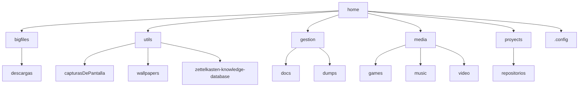

# DOTFILES

## Notas a tener en cuenta en windows
 - Es necesario tener el modo desarrollador activado (al menos en w10) para tener acceso a la herramienta mklink. Y además esta solo está disponible en cmd.exe (no está en powershell por ejemplo) ya que es un built-in, no un ejecutable.
 - Debido a que en windows va todo muy mal, la única configuración que da soporte este repositorio es usando windows subsystem for linux (WSL). Hay que tener en cuenta que funciona muy mal al editar archivos que están fuera del subsistema, así que de momento es mejor evitarlo.

## Notas a tener en cuenta en linux
 - El enlace simbólico que nos interesa hacer es blando. Hay que recordar que en linux el enlace por defecto será duro, habrá que ejecutar ln -s  (soft).
 - Es necesario crear el directorio $HOME/wallpapers para poder tener los fondos de feh al iniciar sesión
 - El script wifi-wakeup (para hacer funcionar el driver wifi MT7630E) necesita tener permisos de ejecución y estar en /lib/systemd/system-sleep/wifi-wakeup para funcionar. Con enlace simbólico funciona también.
 - Para instalar correctamente la configuracion de teclado del moonlander, ejecutar `localectl set-x11-keymap us pc105 dvorak Compose`. La opción Compose permite añadir las deadkeys del archivo .XCompose al layout.
 - Es importante crear la estructura de carpetas (ver subsección) correctamente para que funcionen ciertos scripts, configuraciones y variables del sistema.
 - Para que polybar pueda cargar bien el modulo de batería bluetooth es necesario activar `Experimental = true` en `/etc/bluetooth/main.conf`.
 - Hay dependencias de cara al funcionamiento correcto de rofi y conky con la fuente de OpenMoji para los emoticonos.

### Estructura de carpetas

## Instrucciones de configuración manual

 1. Clonar repositorio en una carpeta. Ej. git clone urldelrepositorio .dotfiles/
 2. Crear enlaces simbólicos en los lugares que corresponda que apunten a este repo local.
    Ej. Ponerse en el directorio ~\.config\nvim y hacer mklink init.vim ~/.dotfiles/init.vim
    Esto dejará sincronizadas las configuraciones en todo el sistema, haciendo más sencillo actualizar entre diferentes PC's.
 3. Crear la estructura de carpetas (es estrictamente necesario en linux).
 4. Crear las variables del sistema necesarias para el correcto funcionamiento de las configuraciones (ver variables del sistema).
 5. Instalar los language servers que usará nvim como cliente para tener funcionalidades de IDE avanzadas.

## Variables del sistema
 En la documentación son referenciadas con el prefijo $ pero en windows se definen sin él.
 En linux los valores por defecto se definen en .config/env_var.sh y se cargan en .bash_profile.

### Neovim / Vim

| Variable |Valor | Observaciones |
| -------- | ---- | ------------- |
| XDG_CONFIG_HOME | ~/.config | Solo es necesario en windows (aunque puede ser conveniente ponerlo en linux si no pilla la configuración de primeras), y en vez de ~ es mejor poner a mano C:\Users\usuario|
| LANG	| en_US.utf-8 | Esto afecta a la configuración de cómo se muestran las fechas para más info :help language|
| ZK_NOTEBOOK_DIR | ~/zettelkasten-knowledge-database | Exportada por defecto en .config/env_var.sh |

### Linux

| Variable |Valor | Observaciones |
| -------- | ---- | ------------- |
| BACKUPDIRS | Lista de los directorios (separados por ':' como en $PATH) que vayan a ser tratados por el script de backup | |
| CALENDARS_DIR | Directorio dónde se almacenan los calendarios | Carpeta con subcarpetas llenas de .ics |

#### Utilidades Systemd

 Es importante ejecutar estas unidades como usuarios (usando la opción **--user**) para que systemd pueda tener en contexto todos los archivos del directorio de usuario
 - backup.timer y backup.service para realizar copias de seguridad

 Las siguientes configuraciones de módulos del kernel pueden ser cargados por systemd.
 Para ello copiarlos en /etc/modules-load.d/ 

 - 60-X670-P.conf da soporte a los sensores de la placa base X670-P.

## TODOs

 - Crear un script que automatice la creación de los enlaces simbólicos
 - Añadir configuracion de vscode (?)
 - Automatizar avisos automáticos al ejecutar el script de backup o algún timer de systemd y se quede sin espacio (o haya demasiado peso en los archivos guardados)    
